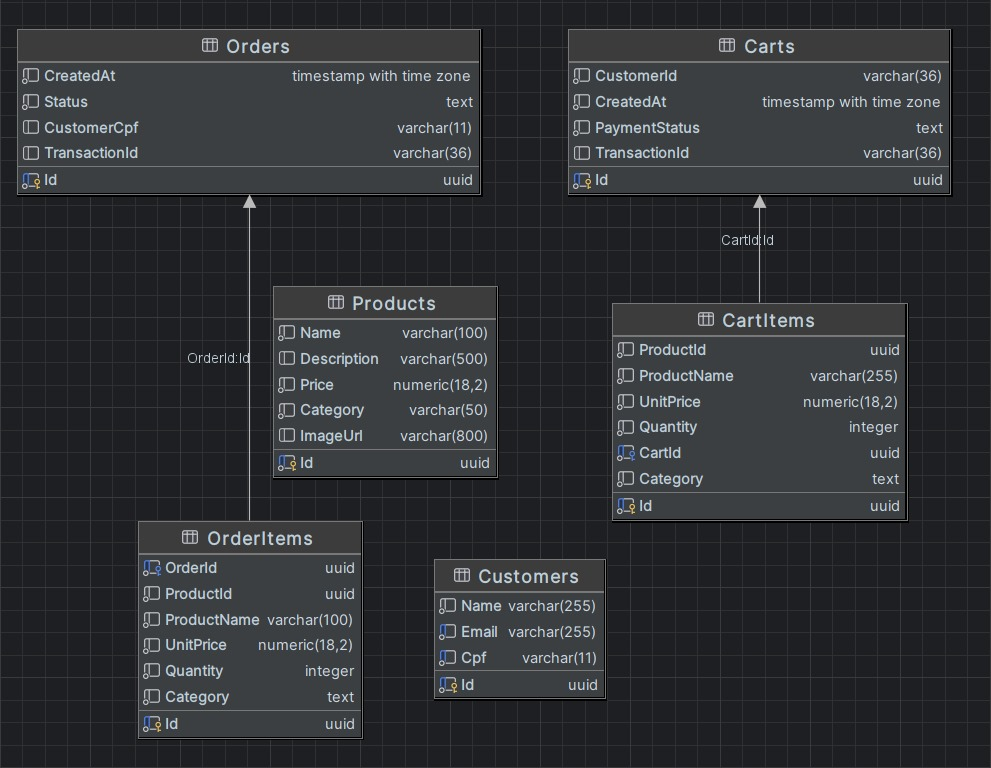

# MyFood

## Descrição

O MyFood é um sistema de pedidos de comida desenvolvido utilizando ASP.NET Core Minimal API com uma arquitetura Clean Architecture. Ele permite que os clientes montem combos personalizados e acompanhem o status de seus pedidos. O sistema também oferece funcionalidades administrativas para gerenciar produtos, categorias e campanhas promocionais.

## Sobre o Projeto

Este projeto faz parte do Tech Challenge da Pós Tech da FIAP do curso de Software Architecture. Trata-se de uma atividade obrigatória que deve ser desenvolvida em grupo e vale 90% da nota de todas as disciplinas da fase. É importante atentar-se ao prazo de entrega.

O repositório do projeto pode ser encontrado [https://github.com/themisterbondy/postech-tech-challenge](https://github.com/themisterbondy/postech-tech-challenge).

## Tecnologias Utilizadas

- **ASP.NET Core Minimal API**
- **Entity Framework Core**
- **PostgreSQL**
- **Docker e Docker Compose**
- **Swagger**
- **OpenTelemetry**
- **Serilog**
- **MediatR**
- **FluentValidation**
- **HealthChecks**
- **Quartz.NET** (para gerenciamento de jobs)

## Estrutura do Projeto

- **Arquitetura Hexagonal**
- **Feature Folder**
- **Documentação com Event Storming**

## Funcionalidades

### Cliente

- **Identificação e Cadastro**:
  - Identificação via CPF
  - Cadastro com nome e e-mail
  - Opção de não se identificar

- **Montagem de Combo**:
  - Lanche
  - Acompanhamento
  - Bebida
  - Sobremesa
  - Exibição de nome, descrição e preço de cada produto

- **Acompanhamento**:
  - Monitoramento do progresso do pedido: Recebido, Em preparação, Pronto, Finalizado

### Administrativo

- **Gerenciamento de Clientes**:
  - Cadastro e manutenção para campanhas promocionais

- **Gerenciamento de Produtos e Categorias**:
  - Lanche, Acompanhamento, Bebida, Sobremesa

- **Acompanhamento de Pedidos**:
  - Monitoramento de pedidos em andamento e tempo de espera

## APIs

- **Cadastro do Cliente**
- **Identificação do Cliente via CPF**
- **Criar, Editar e Remover Produtos**
- **Buscar Produtos por Categoria**
- **Fake Checkout**
- **Listar Pedidos**

## Carrinho de Compras

O sistema permite que os clientes adicionem itens ao carrinho, e o carrinho pode ser recuperado ou modificado até que o checkout seja realizado.

- **Adicionar ao Carrinho**: Permite que os clientes adicionem produtos ao carrinho.
- **Remover do Carrinho**: Permite que os clientes removam itens do carrinho.
- **Limpar Carrinho**: Remove todos os itens do carrinho.
- **Checkout Fake**: Simula o processo de checkout, onde os itens no carrinho são processados para criar um pedido. O pagamento é simulado, podendo ser aceito ou rejeitado.

### Limpeza de Carrinho

Um job é executado a cada 5 minutos para verificar e remover carrinhos que foram criados há mais de 15 minutos e não foram utilizados.

### Cancelamento de Pedidos

Um segundo job é executado a cada 30 minutos para cancelar pedidos na fila (`OrderQueue`) que foram criados há mais de 30 minutos e ainda estão com o status "Recebido". Esses pedidos são automaticamente marcados como "Cancelados".

## Documentação

A documentação do sistema foi desenvolvida seguindo os padrões de Domain-Driven Design (DDD) com Event Storming, cobrindo os fluxos de realização do pedido e pagamento, preparação e entrega do pedido.

Os desenhos e diagramas do Event Storming podem ser encontrados [https://miro.com/app/board/uXjVK06l1is=/](https://miro.com/app/board/uXjVK06l1is=/).

### Postman

Link do Postman [https://www.postman.com/blue-crater-21969/workspace/postech/collection/389375-9e6deac9-fe83-4f67-9072-a55063ff590d?action=share&creator=38874442](https://www.postman.com/blue-crater-21969/workspace/postech/collection/389375-9e6deac9-fe83-4f67-9072-a55063ff590d?action=share&creator=38874442)

## Migrações e Dados Pré-Incluídos

O sistema utiliza migrações do Entity Framework Core para gerenciar o esquema do banco de dados. As migrações são aplicadas automaticamente durante a inicialização da aplicação.

### Modelagem banco de dados



### Clientes Pré-Incluídos

- **John Doe**
  - CPF: 36697999071
  - Email: john.doe@email.com

### Produtos Pré-Incluídos

- **McFritas Média**
  - Id: 6937a222-4e5e-4a75-abde-9ab3b9f58b0f
  - Categoria: Acompanhamento
  - Descrição: A batata frita mais famosa do mundo. Deliciosas batatas selecionadas, fritas, crocantes por fora, macias por dentro, douradas, irresistíveis, saborosas, famosas, e todos os outros adjetivos positivos que você quiser dar.
  - Preço: $2.99
  - Imagem: 

- **Casquinha Chocolate**
  - Id: 024fb6ba-5ebe-4131-a27e-d10a4041b32d
  - Categoria: Sobremesa
  - Descrição: A sobremesa que o Brasil todo adora. Uma casquinha supercrocante, com bebida láctea sabor chocolate que vai bem a qualquer hora.
  - Preço: $1.49
  - Imagem: 

- **Big Mac**
  - Id: 81e0a7f0-77e9-433f-9f2c-1b131c3317c3
  - Categoria: Lanche
  - Descrição: Dois hambúrgueres (100% carne bovina), alface americana, queijo processado sabor cheddar, molho especial, cebola, picles e pão com gergelim.
  - Preço: $5.99
  - Imagem: 

- **Coca-Cola 300ml**
  - Id: 84d18030-66cc-4f12-bf5f-988667805bf8
  - Categoria: Bebida
  - Descrição: Refrescante e geladinha. Uma bebida assim refresca a vida. Você pode escolher entre Coca-Cola, Coca-Cola Zero, Sprite sem Açúcar, Fanta Guaraná e Fanta Laranja.
  - Preço: $1.99
  - Imagem: 

## Instruções para Configuração

### Requisitos

- Docker
- Docker Compose

### Passos para Configuração

1. Clone o repositório:
    ```shell
    git clone https://github.com/themisterbondy/postech-tech-challenge.git
    cd postech-tech-challenge
    ```

2. Configure o certificado HTTPS executando os seguintes comandos:
    ```shell
    dotnet dev-certs https --clean
    dotnet dev-certs https -ep $env:userprofile\.aspnet\https\aspnetapp.pfx -p password123
    dotnet dev-certs https --trust
    ```

3. Suba os containers:
    ```shell
    docker-compose up --build
    ```

4. Acesse o Swagger para explorar as APIs: [https://localhost:8081/swagger](https://localhost:8081/swagger)


### Passos para Utilização HELM

1. Criar postgres e namespace:
    ```shell
    helm install myfood-postgres .\charts\postgres\ --namespace myfood-namespace --create-namespace
    ```

2. Cria pods de aplicação: 
    ```shell
    helm install myfood-webapi .\charts\webapi\ --namespace myfood-namespace
    ```

3. Valida estado dos Pods
    ```shell
    kubectl get pods --namespace myfood-namespace --watch
    ```

4. Url de acesso a aplicação 
    ```shell
    http://localhost:30000
    ```

5. Visualizar Logs de pods 
    ```shell
      kubectl describe pod {{myfood-webapi}} --namespace myfood-namespace
    ```

6. Deletar NameSpace ( deleta todos os recursos criados )
    ```shell
    kubectl delete namespace myfood-namespace
    ```       


## Validação da POC

### Infraestrutura

- 1 instância para banco de dados
- 1 instância para executar aplicação

## HealthChecks

O sistema inclui configurações de HealthChecks para monitorar a saúde do sistema, incluindo o banco de dados PostgreSQL. Os endpoints de HealthCheck estão configurados para fornecer informações sobre o status do sistema e detalhes dos monitores de saúde.

### Endpoints de HealthCheck

- **Status Text**: [https://localhost:8081/status-text](https://localhost:8081/status-text)
- **Health Status**: [https://localhost:8081/health](https://localhost:8081/health)

## Middleware de Logging de Contexto de Requisição

O sistema inclui um middleware de logging de contexto de requisição utilizando Serilog. Este middleware adiciona um ID de correlação a cada requisição para melhor rastreamento e correlação de logs.

## Manipulador Global de Exceções

O sistema inclui um manipulador global de exceções que registra erros e retorna uma resposta JSON padronizada com detalhes do problema.